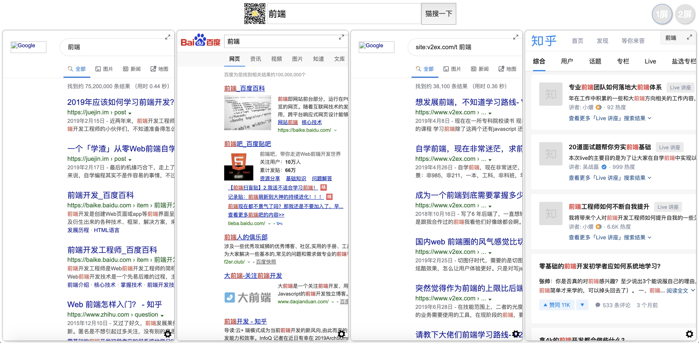

# 简介

猫搜(moresearch)是一个多页聚合搜索引擎，为提高搜索效率而生。纯前端，使用Angular构建。你可以[点击这里](https://juejin.im/post/5e147c716fb9a0480d1702d1)阅读更多内容。

~~由于**跨域限制，您需要禁止「浏览器同源策略」后运行访问，或自行搭建代理服务器**~~。**推荐使用Chrome**。

~~Mac下Chrome如何禁止同源策略：~~

~~1. 完全退出浏览器~~

~~2. 命令行下运行：~~
~~open -a "Google Chrome" --args --disable-web-security  --user-data-dir~~

~~Windows及其他浏览器「禁止同源策略」的方法可自行搜索。~~

由于禁止浏览器同源策略运行，此操作**极端危险**，故我们不再推荐此方式。推荐大家使用**Chrome插件[iHeader](http://github.com/Louiszhai/IHeader)**来完成X-Frame-Options响应头的去除，或者也可以自行**搭建代理服务器**。

# 效果图



# 构建运行

## 依赖

```shell
1. Node.js 10.9.0或更高版本

2. Angular CLI:

npm install -g @angular/cli
```

## 如何构建

1. 克隆本项目到你本地
   
```shell
git clone https://github.com/xuefengnice/MoreSearch.git
```

2. cd到项目根目录

```shell
cd ./MoreSearch
```

3. 安装npm包

```shell
npm install
```

4. 构建运行

```shell
ng serve --open
```

# 关于

本项目为闲暇之余构建，感兴趣的朋友可以扫码关注公众号**加群交流**，亦可吹水摸鱼：）

> 斜杠青年：独立开发者/业余交易员/传统文化爱好者
> 
> 更多原创尽在公众号: 「优雅的程序员呀」。全栈。程序员赚钱之道。优雅的技术，优雅的赚钱。
>
> 关注公众号，可以加我好友交流，也可加群技术交流哦。


