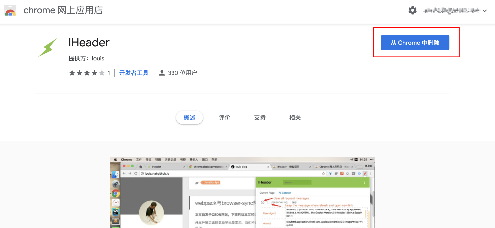
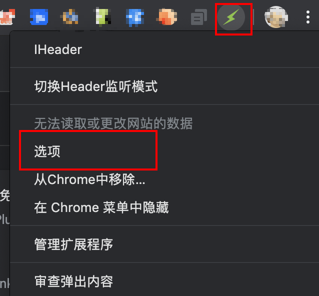
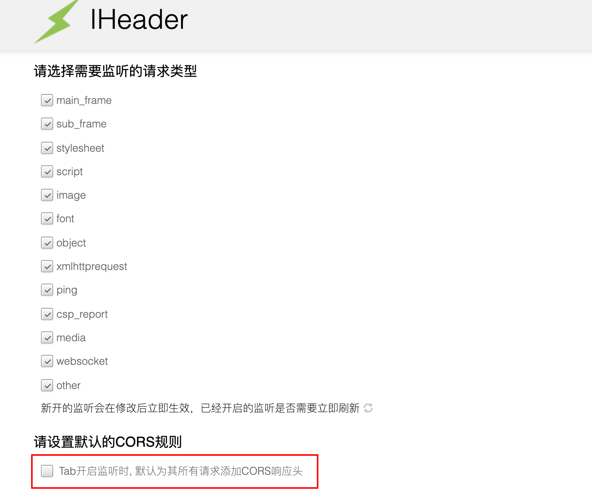
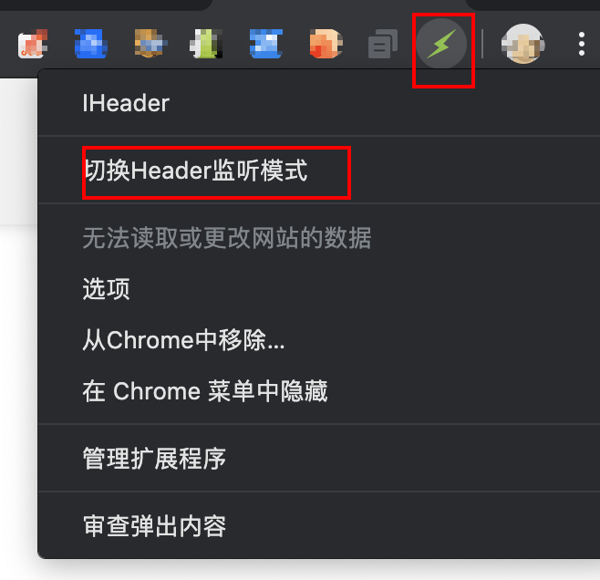
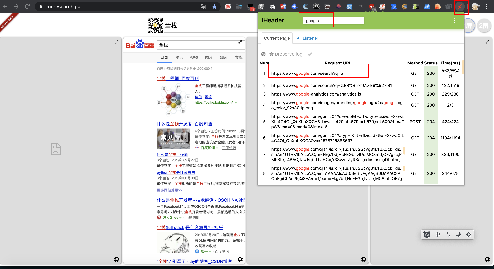
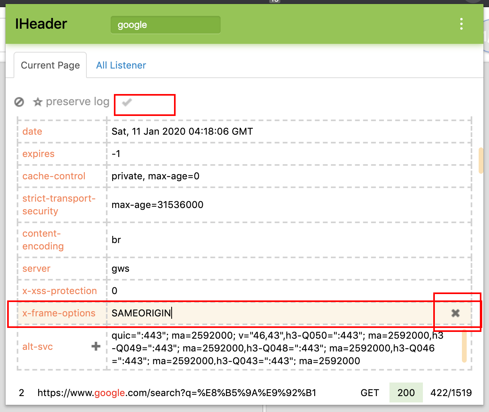
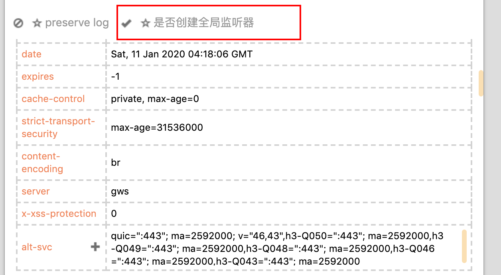
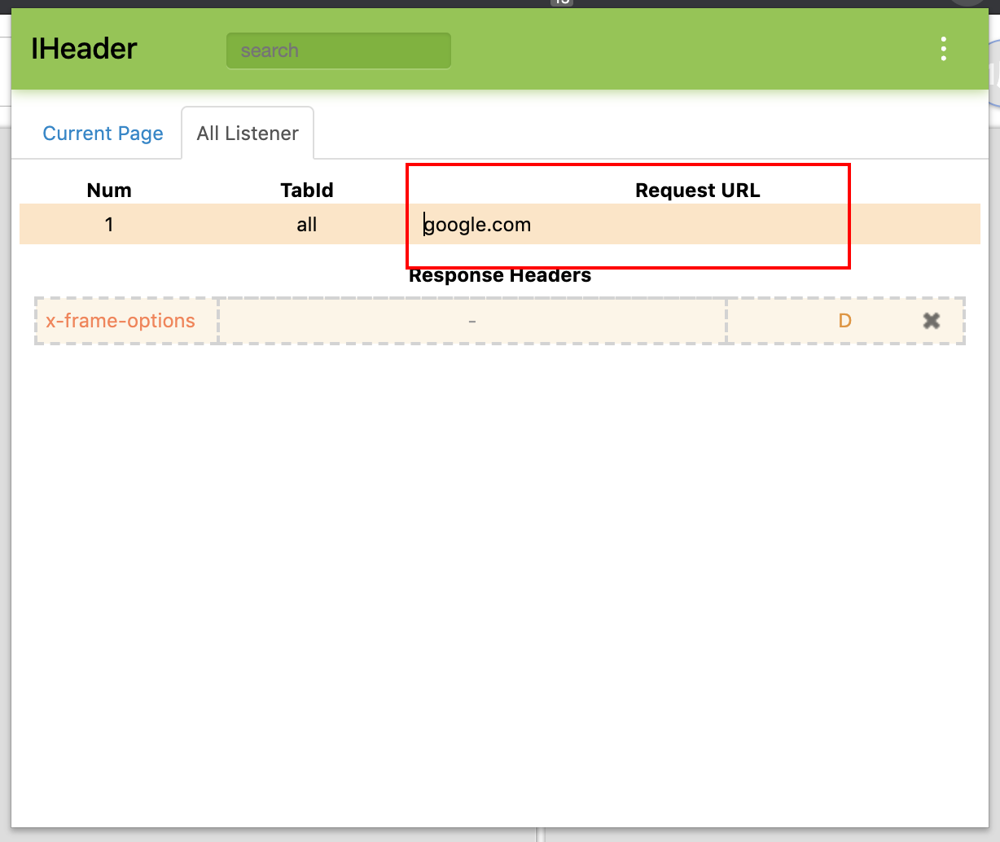
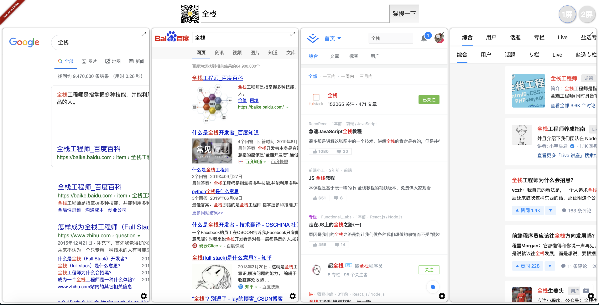

依据以下方法**只需配置一次**，只要不关闭插件，就可以一直使用了。

---

# 1. 打开Chrome，下载并安装iHeader插件

1. 您可以**通过chrome应用商店**下载：

    [点击这里](https://chrome.google.com/webstore/detail/iheader/polajedphjkpjbfljoabmcejpcckeked?utm_source=chrome-ntp-icon)

    

    这里因为我已经安装过，所以显示"从Chrome中删除"，你的应该是安装。

2. 也可以通过Github下载源码使用开发者模式安装：

    [点击这里](https://github.com/Louiszhai/IHeader)

    记得在chrome扩展中打开开发者模式

    

# 2. 安装完成，配置iHeader

1. 首先对插件图标右键，进入选项设置，把「ab开启监听时, 默认为其所有请求添加CORS响应头」**打勾去掉**，这个是解决跨域的响应头，有时候会出问题，比如访问掘金的时候，等有需要我们再为单独请求添加。

2. 对插件图标右键，**打开监听模式**。

3. 新标签页打开猫搜 https://www.moresearch.ga

4. 在猫搜界面随便搜索一个(发现只有百度打开了..)，iHeader拦截相应请求，并过滤想修改header的域名，比如google

5. 修改Response header，**把X-Frame-Options响应头删除**，点击创建全局监听、然后点击对勾完成。

6. 切换到All listener去修改域名，比如google。完成✅

7. 根据以上方法，**修改其他域名**的响应头，比如zhihu.com等，重新搜索一下：

噔！噔！噔！打开了! perfect~

