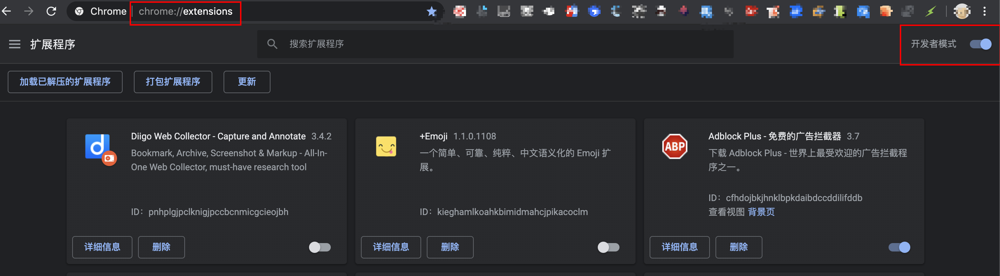

说明：Fork了[iHeader项目](https://github.com/xuefengnice/IHeader)，并扩展，**安装即用**。

ps. 时间有限，代码未整理，只为快速适配猫搜。会添加一条All listener的适配所有URL的规则，以去除X-Frame-Options响应头。

~~老版本使用说明，[参见这里](https://github.com/xuefengnice/MoreSearch/blob/master/how-to-use-old.md)。~~

# 如何安装

1. 克隆iHeader项目到你本地
   
```shell
git clone https://github.com/xuefengnice/IHeader.git
```

2. 使用chrome开发者模式加载此插件**根目录**（加载已解压的扩展程序）即可。

